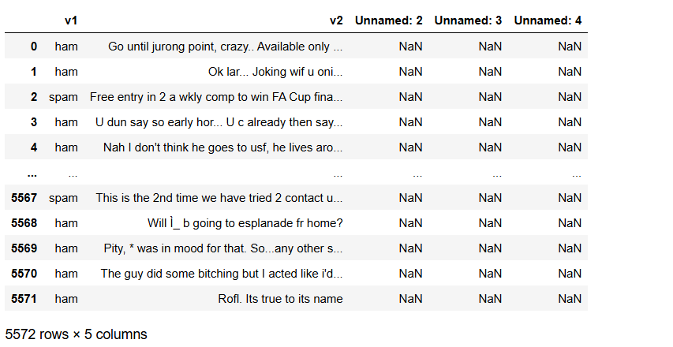
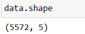
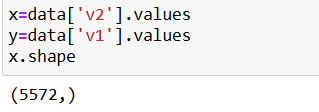
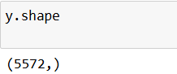
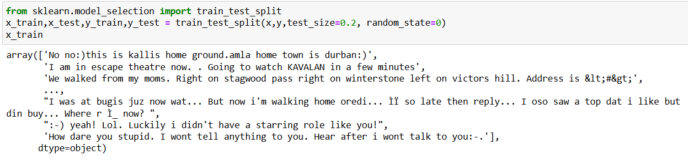
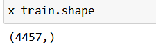
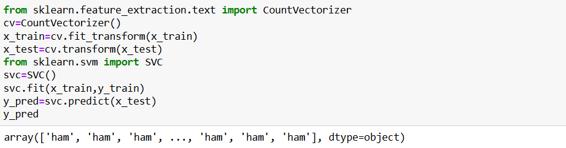
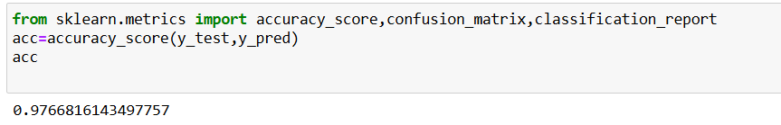
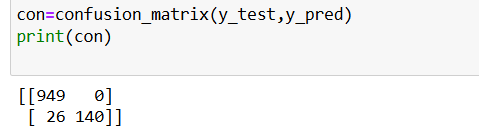
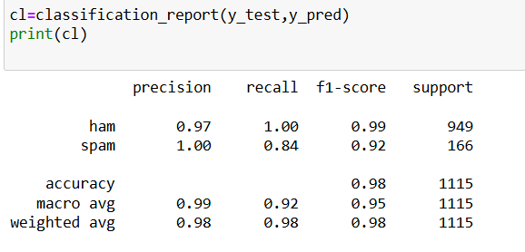

# Implementation-of-SVM-For-Spam-Mail-Detection

## AIM:
To write a program to implement the SVM For Spam Mail Detection.

## Equipments Required:
1. Hardware – PCs
2. Anaconda – Python 3.7 Installation / Jupyter notebook

## Algorithm
1. Import necessary libraries such as pandas, CountVectorizer, SVC, and metrics from sklearn for data handling, feature extraction, model building, and evaluation.

2. Load and preprocess the dataset using pandas.read_csv() with correct encoding, then extract input features (x = data['v2']) and target labels (y = data['v1']).

3. Split the dataset into training and testing sets using train_test_split() to prepare data for model training and validation.

4. Convert text data into numeric form using CountVectorizer() to transform the text messages into word count vectors (Bag-of-Words model).

5. Train and test the SVM model using svc.fit(x_train, y_train) and svc.predict(x_test), then evaluate performance with accuracy, confusion matrix, and classification report.

## Program:
```
import pandas as pd
data=pd.read_csv("spam.csv", encoding='Windows-1252')
data

data.shape

x=data['v2'].values
y=data['v1'].values
x.shape

y.shape

from sklearn.model_selection import train_test_split
x_train,x_test,y_train,y_test = train_test_split(x,y,test_size=0.2, random_state=0)
x_train

x_train.shape

from sklearn.feature_extraction.text import CountVectorizer
cv=CountVectorizer()
x_train=cv.fit_transform(x_train)
x_test=cv.transform(x_test)
from sklearn.svm import SVC
svc=SVC()
svc.fit(x_train,y_train)
y_pred=svc.predict(x_test)
y_pred

from sklearn.metrics import accuracy_score,confusion_matrix,classification_report
acc=accuracy_score(y_test,y_pred)
acc

con=confusion_matrix(y_test,y_pred)
print(con)

cl=classification_report(y_test,y_pred)
print(cl)

```

## Output:





















## Result:
Thus the program to implement the SVM For Spam Mail Detection is written and verified using python programming.
